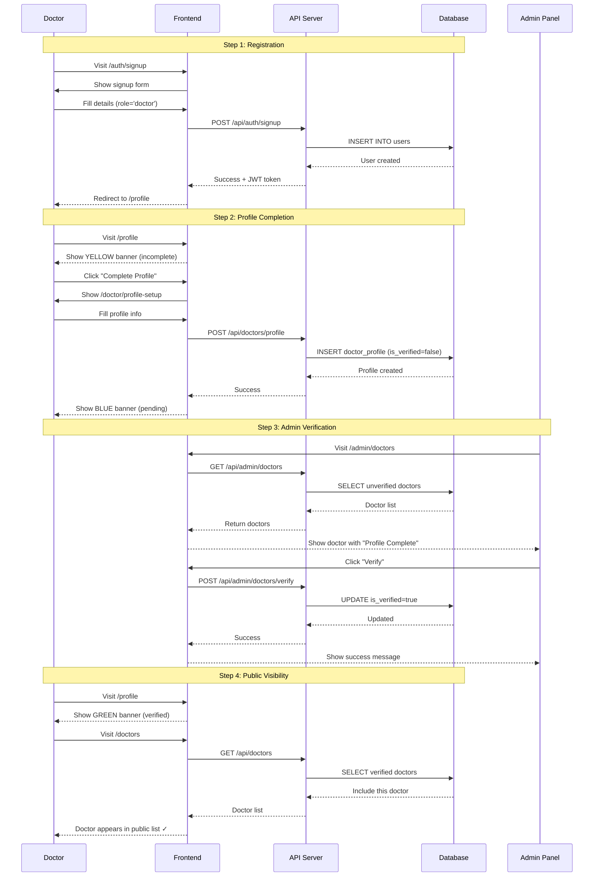
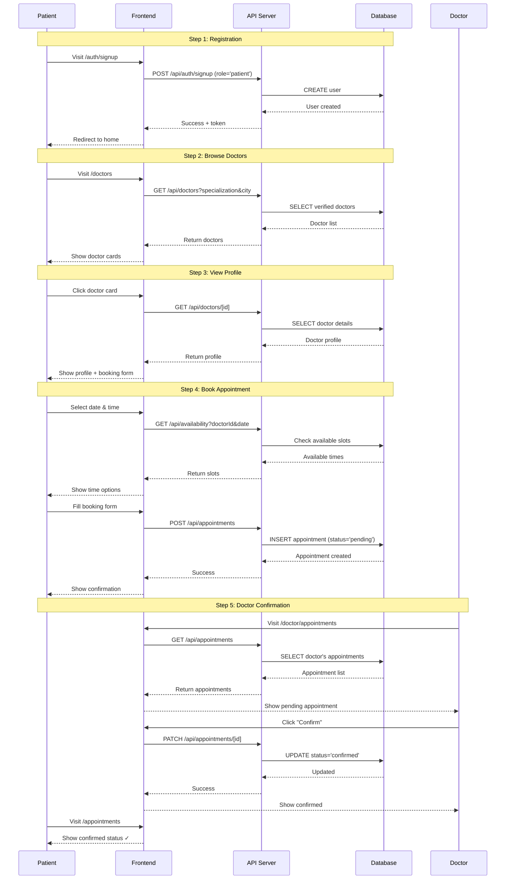
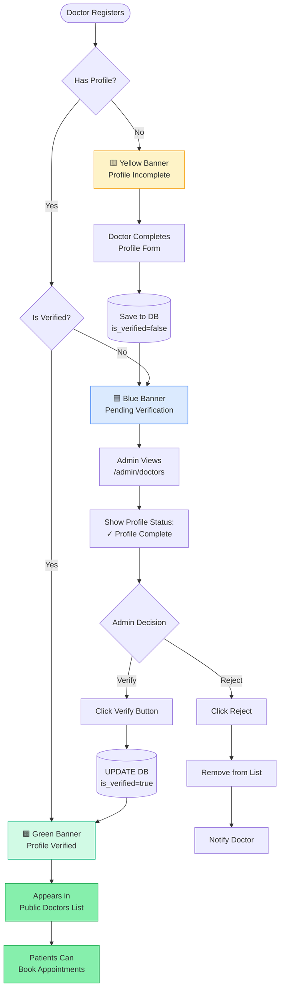
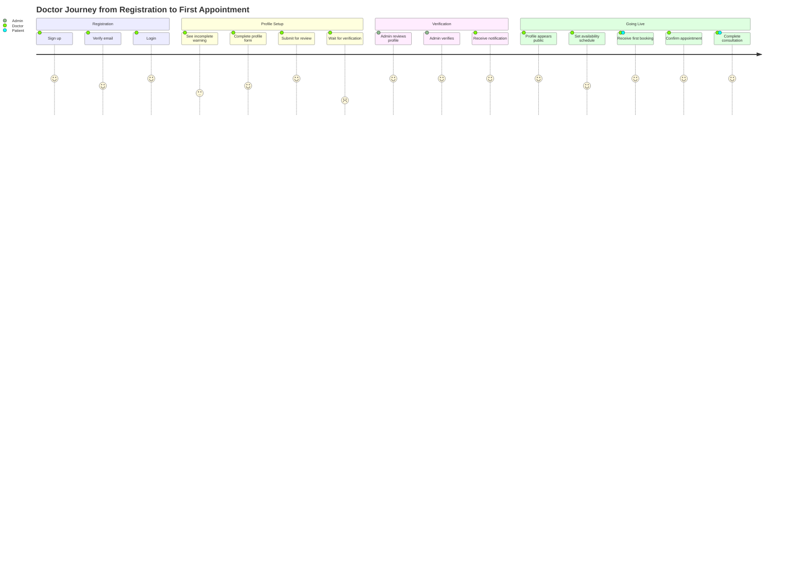
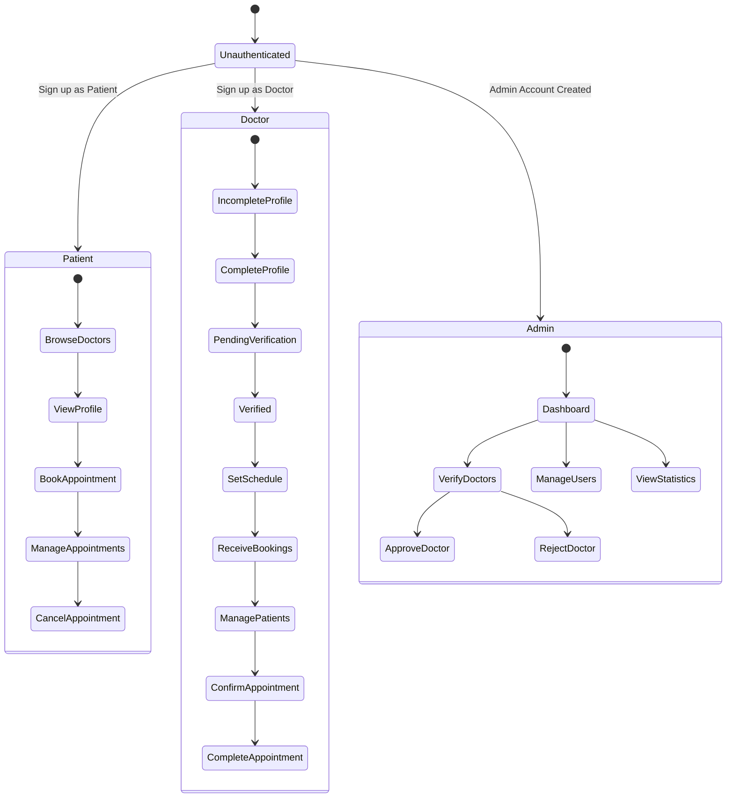
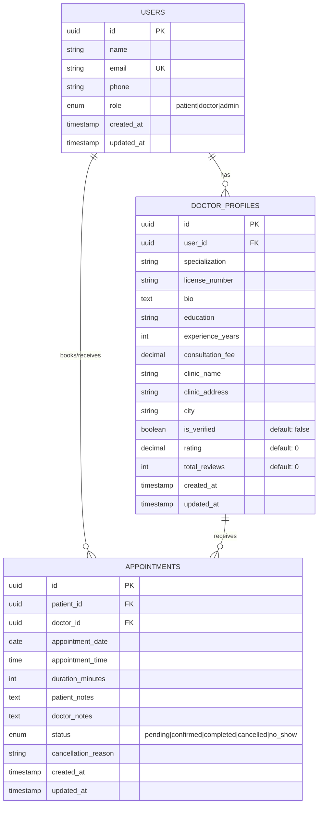

# Randevu - Complete User Workflow Documentation

## Overview
Randevu is a doctor appointment booking platform with three user types: **Patients**, **Doctors**, and **Admins**. This document explains the complete workflow for each user type.

---

## 📊 Visual Flow Diagrams

### System Architecture Overview

```mermaid
graph TB
    subgraph Users
        P[Patient]
        D[Doctor]
        A[Admin]
    end

    subgraph Frontend["Next.js Frontend"]
        HP[Home Page]
        DL[Doctors List]
        DP[Doctor Profile]
        AP[Appointments]
        PR[Profile Pages]
        AD[Admin Panel]
    end

    subgraph Backend["API Routes"]
        AUTH[/api/auth]
        DOCS[/api/doctors]
        APPT[/api/appointments]
        ADM[/api/admin]
    end

    subgraph Database["PostgreSQL"]
        UT[users table]
        DPT[doctor_profiles table]
        APT[appointments table]
    end

    P --> HP
    P --> DL
    P --> DP
    P --> AP
    D --> PR
    D --> AP
    A --> AD

    HP --> AUTH
    DL --> DOCS
    DP --> DOCS
    AP --> APPT
    PR --> DOCS
    AD --> ADM

    AUTH --> UT
    DOCS --> UT
    DOCS --> DPT
    APPT --> APT
    ADM --> UT
    ADM --> DPT

    style P fill:#60a5fa
    style D fill:#34d399
    style A fill:#a78bfa
    style Database fill:#fbbf24
```

### Doctor Registration & Verification Flow



### Patient Appointment Booking Flow



### Admin Doctor Verification Process



### Complete User Journey Map



### Authentication & Authorization Flow



### Database Entity Relationships



---

## 🔄 Complete System Flow

```
┌─────────────────────────────────────────────────────────────────┐
│                     DOCTOR REGISTRATION FLOW                    │
└─────────────────────────────────────────────────────────────────┘

1. Doctor Signs Up (/auth/signup)
   │
   ├─> Account Created (role='doctor')
   │
   └─> Redirected to Homepage
       │
       └─> NOT visible in public doctors list yet ⚠️

2. Doctor Logs In & Visits Profile (/profile)
   │
   ├─> Sees YELLOW BANNER: "Complete Your Doctor Profile"
   │
   └─> Clicks "Complete Profile" → /doctor/profile-setup

3. Doctor Completes Profile
   │
   ├─> Fills Required Information:
   │   • Specialization (required)
   │   • License Number
   │   • Bio & Education
   │   • Experience Years
   │   • Consultation Fee
   │   • Clinic Name & Address
   │   • City
   │
   └─> Submits Profile
       │
       ├─> Profile Saved (is_verified=false)
       │
       └─> Sees BLUE BANNER: "Profile Pending Verification"

4. Admin Reviews & Verifies (/admin/doctors)
   │
   ├─> Admin sees doctor in pending list
   │   • Profile Status: "Profile Complete" ✓
   │   • Shows: Specialization, City
   │
   └─> Admin Clicks "Verify"
       │
       └─> Doctor profile marked as verified (is_verified=true)

5. Doctor Now Appears in Public Directory (/doctors)
   │
   └─> Visible to all patients ✅

┌─────────────────────────────────────────────────────────────────┐
│                     PATIENT BOOKING FLOW                        │
└─────────────────────────────────────────────────────────────────┘

1. Patient Signs Up (/auth/signup)
   │
   └─> Account Created (role='patient')

2. Patient Browses Doctors (/doctors)
   │
   ├─> Sees list of verified doctors
   ├─> Can filter by: Specialization, City
   │
   └─> Clicks on a doctor card

3. Patient Views Doctor Profile (/doctors/[id])
   │
   ├─> Sees Doctor Information:
   │   • Name, Specialization, Rating
   │   • Bio, Education, Experience
   │   • Consultation Fee
   │   • Clinic Address
   │
   └─> Sees Booking Form

4. Patient Books Appointment
   │
   ├─> Selects:
   │   • Appointment Date
   │   • Appointment Time
   │   • Duration (default: 30 min)
   │   • Optional Notes
   │
   ├─> Clicks "Book Appointment"
   │
   └─> Appointment Created (status='pending')

5. Patient Manages Appointments (/appointments)
   │
   ├─> Views Upcoming/Past Appointments
   ├─> Sees Status: Pending/Confirmed/Completed/Cancelled
   ├─> Can Cancel with Reason
   │
   └─> Receives Updates from Doctor

┌─────────────────────────────────────────────────────────────────┐
│                  DOCTOR APPOINTMENT MANAGEMENT                  │
└─────────────────────────────────────────────────────────────────┘

1. Doctor Views Appointments (/doctor/appointments)
   │
   ├─> Filters: Today / Upcoming / All
   │
   └─> Sees Patient Information:
       • Name, Email, Phone
       • Date, Time, Duration
       • Patient Notes
       • Current Status

2. Doctor Manages Appointments
   │
   ├─> Can Confirm (pending → confirmed)
   ├─> Can Mark Complete (add notes)
   ├─> Can Mark No-Show
   │
   └─> Patient sees updates in real-time

3. Doctor Can Set Availability (/doctor/schedule)
   │
   └─> Configure weekly schedule slots

┌─────────────────────────────────────────────────────────────────┐
│                    ADMIN MANAGEMENT FLOW                        │
└─────────────────────────────────────────────────────────────────┘

1. Admin Dashboard (/admin)
   │
   ├─> View System Statistics
   ├─> Manage Users
   │
   └─> Verify Doctors (/admin/doctors)

2. Doctor Verification (/admin/doctors)
   │
   ├─> See All Unverified Doctors
   │   • Profile Status (Complete/Incomplete)
   │   • Specialization & City
   │   • Registration Date
   │
   ├─> Review Doctor Information
   │
   └─> Actions:
       • Verify (if profile complete) ✓
       • Reject (with reason) ✗

3. User Management (/admin/users)
   │
   └─> View All Users by Role
```

---

## 📝 Detailed User Guides

### For Doctors

#### Step 1: Register Your Account
1. Visit `/auth/signup`
2. Select "Healthcare Provider" as your role
3. Fill in your name, email, and password
4. Click "Sign Up"

#### Step 2: Complete Your Professional Profile
1. After logging in, go to `/profile`
2. You'll see a **yellow banner** prompting you to complete your profile
3. Click "Complete Profile" to go to `/doctor/profile-setup`
4. Fill in all information:
   - **Specialization** (required) - e.g., "Cardiology", "Pediatrics"
   - **License Number** - Your medical license number
   - **Bio** - Brief description of your practice
   - **Education** - Your medical degree and institution
   - **Experience Years** - Years of practice
   - **Consultation Fee** - Your consultation charge
   - **Clinic Name** - Where you practice
   - **Clinic Address** - Full address
   - **City** - City of practice
5. Click "Save Profile"

#### Step 3: Wait for Admin Verification
1. After submitting, you'll see a **blue banner**: "Profile Pending Verification"
2. An admin will review your profile
3. You'll be notified once verified
4. **Note:** You won't appear in the public directory until verified

#### Step 4: Manage Your Appointments
Once verified, you can:
1. Go to `/doctor/appointments` to see all appointments
2. Filter by: Today / Upcoming / All
3. For each appointment, you can:
   - **Confirm** pending appointments
   - **Add notes** after consultation
   - **Mark complete** when done
   - **Mark no-show** if patient doesn't arrive

#### Step 5: Set Your Availability
1. Visit `/doctor/schedule`
2. Configure your weekly availability
3. Set time slots when you accept appointments

---

### For Patients

#### Step 1: Create Your Account
1. Visit `/auth/signup`
2. Select "Patient" as your role
3. Fill in your details and sign up

#### Step 2: Find a Doctor
1. Visit `/doctors` to browse verified doctors
2. Use filters:
   - **Specialization** - Find specialists
   - **City** - Find doctors near you
3. View doctor ratings and reviews
4. Click on a doctor card to see full profile

#### Step 3: Book an Appointment
1. On the doctor's profile page (`/doctors/[id]`), scroll to the booking form
2. Select:
   - **Date** - Choose available date
   - **Time** - Select time slot
   - **Duration** - Usually 30 minutes
   - **Notes** (optional) - Add any relevant information
3. Click "Book Appointment"
4. You'll see a confirmation message

#### Step 4: Manage Your Appointments
1. Visit `/appointments` to see all your bookings
2. Filter by:
   - **Upcoming** - Future appointments
   - **Past** - Completed/cancelled appointments
   - **All** - Everything
3. For active appointments, you can:
   - View details
   - **Cancel** with a reason (if needed)
4. See appointment status:
   - **Pending** - Waiting for doctor confirmation
   - **Confirmed** - Doctor confirmed
   - **Completed** - Consultation done
   - **Cancelled** - Appointment cancelled

---

### For Admins

#### Doctor Verification Process
1. Go to `/admin/doctors`
2. Review the list of unverified doctors
3. Check each doctor's:
   - **Profile Status**
     - ✓ "Profile Complete" (green) - Ready to verify
     - ⚠️ "No Profile" (yellow) - Doctor hasn't completed profile yet
   - **Specialization**
   - **City**
   - **Registration Date**
4. For doctors with complete profiles:
   - Click "Verify" to approve
   - Doctor immediately appears in public directory
5. For doctors without profiles:
   - "Verify" button is disabled
   - They must complete profile first

#### User Management
1. Visit `/admin/users` to view all users
2. See users organized by role
3. Monitor system activity

---

## 🔐 Security & Permissions

### Doctor Visibility Rules
- ❌ **NOT VISIBLE**: Unregistered doctors
- ❌ **NOT VISIBLE**: Doctors without profile
- ❌ **NOT VISIBLE**: Doctors with unverified profile
- ✅ **VISIBLE**: Doctors with complete + verified profile

### Booking Permissions
- Only **logged-in patients** can book appointments
- Only **verified doctors** receive appointments
- Doctors can only manage their own appointments
- Patients can only manage their own appointments

### Admin Permissions
- Can verify/reject doctors
- Can view all users
- Can manage system settings
- Cannot book appointments (admin role is management only)

---

## 🚀 Quick Start Checklist

### For New Doctors
- [ ] Sign up with "Healthcare Provider" role
- [ ] Log in and go to Profile page
- [ ] Click "Complete Profile"
- [ ] Fill in all professional information
- [ ] Submit profile for verification
- [ ] Wait for admin approval (usually 24-48 hours)
- [ ] Once verified, configure your schedule
- [ ] Start accepting appointments!

### For New Patients
- [ ] Sign up with "Patient" role
- [ ] Log in to the platform
- [ ] Browse doctors by specialization or city
- [ ] Click on a doctor to view their profile
- [ ] Select date and time for appointment
- [ ] Add any notes if needed
- [ ] Book appointment
- [ ] Check appointment status in "My Appointments"

### For Admins
- [ ] Review pending doctor applications daily
- [ ] Check if profile is complete before verifying
- [ ] Approve qualified doctors
- [ ] Monitor system for any issues

---

## ❓ Frequently Asked Questions

### For Doctors

**Q: Why am I not appearing in the doctors list?**
A: You need to complete your profile AND get admin verification. Check your profile page for status.

**Q: How long does verification take?**
A: Usually 24-48 hours. Make sure your profile is complete.

**Q: Can I update my profile after verification?**
A: Yes! Go to `/doctor/profile-setup` anytime to update.

**Q: What if I don't see any appointments?**
A: Make sure you're verified and your schedule is set up.

### For Patients

**Q: I can't book an appointment. Why?**
A: Make sure you're logged in with a patient account.

**Q: Can I book multiple appointments with the same doctor?**
A: Yes! Book as many as you need.

**Q: How do I cancel an appointment?**
A: Go to "My Appointments" and click "Cancel" - provide a reason.

**Q: What if the doctor doesn't confirm my appointment?**
A: Wait 24 hours. If no response, contact support or book with another doctor.

### For Admins

**Q: Can I verify a doctor without a profile?**
A: No, the "Verify" button is disabled until they complete their profile.

**Q: What should I check before verifying a doctor?**
A: Check their profile is complete with valid specialization, education, and credentials.

---

## 📊 System Status Indicators

### Profile Status (Doctor)
- 🟨 **Yellow Banner**: Profile incomplete - action required
- 🟦 **Blue Banner**: Profile pending verification - waiting for admin
- 🟩 **Green Banner**: Profile verified - ready to accept appointments

### Appointment Status
- 🟨 **Pending**: Waiting for doctor confirmation
- 🟩 **Confirmed**: Doctor confirmed the appointment
- 🟦 **Completed**: Consultation finished
- 🟥 **Cancelled**: Appointment cancelled
- ⬜ **No Show**: Patient didn't attend

---

## 🛠️ Technical Details

### Database States
- User: `role` = 'doctor' | 'patient' | 'admin'
- Doctor Profile: `is_verified` = true | false
- Appointment: `status` = 'pending' | 'confirmed' | 'completed' | 'cancelled' | 'no_show'

### API Endpoints
- `GET /api/doctors` - Public verified doctors list
- `GET /api/doctors/[id]` - Doctor profile details
- `POST /api/doctors/profile` - Create/update doctor profile
- `POST /api/appointments` - Book appointment (patient only)
- `GET /api/appointments` - Get user appointments
- `PATCH /api/appointments/[id]` - Update appointment (doctor only)
- `POST /api/admin/doctors/verify` - Verify doctor (admin only)

---

## 📞 Support

For issues or questions:
1. Check this documentation first
2. Review your profile status
3. Contact system administrator
4. Report bugs on GitHub

---

**Last Updated:** 2025-01-15
**Version:** 1.0.0
